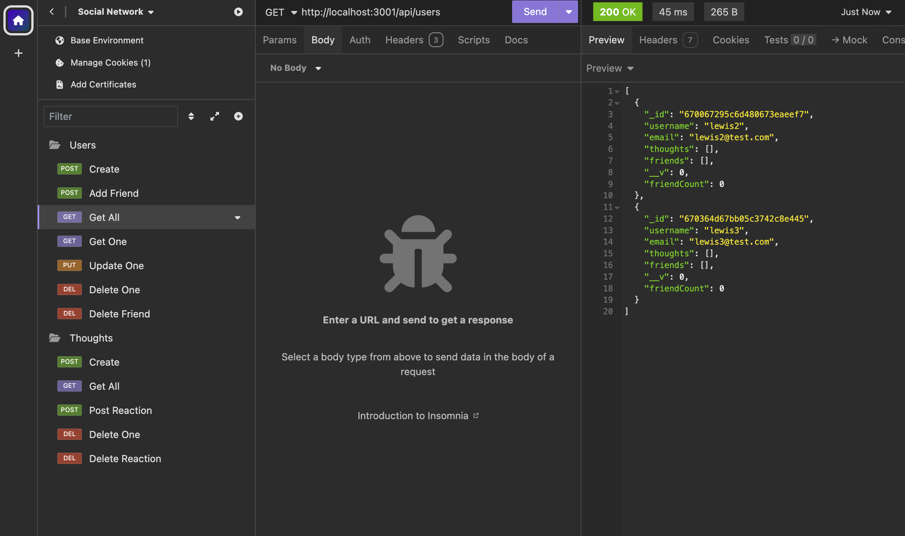

# Social-Network-API
This is an API for a social network that uses a NoSQL database.

When the user tests API POST, PUT, and DELTE routes in Insomnia, they are able to create,update, and delete users and thoughts in their database.

They are also able to create and delete reactions to thoughts and add and remove friends to a friend list.

